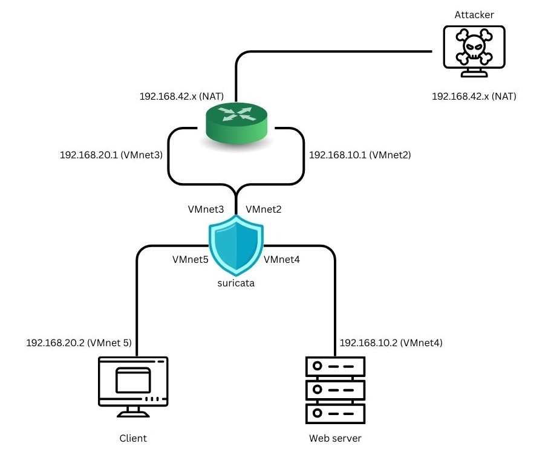

# 🛠️ Setup Suricata on VMware

## 🌐 Network Topology

### 🔸 Router
- `ens33`: `192.168.42.130` (NAT)
- `ens34`: `192.168.10.1` → `vm2`
- `ens35`: `192.168.20.1` → `vm3`

### 🔸 Server
- `ens33`: `192.168.10.2` → `vm4`

### 🔸 Client
- `ens33`: `192.168.20.2` → `vm5`

### 🔸 Kali
- Connected via **NAT**

### 🔸 Suricata IDS/IPS
- `ens33`: `192.168.42.142` (NAT)
- `ens37`: connected to `vm5`
- `ens38`: connected to `vm3`
- `ens39`: connected to `vm2`
- `ens40`: connected to `vm4`

## ⚙️ Router Configuration

### Enable IP Forwarding
```bash
sudo nano /etc/sysctl.conf
# Uncomment the following line:
net.ipv4.ip_forward=1

sudo sysctl -p
```

### Setup NAT (`ens33` as NAT interface)
```bash
sudo iptables -t nat -A POSTROUTING -o ens33 -j MASQUERADE
```

### Check Routing Table
```bash
ip route
```

Sample output:
```
default via 192.168.42.2 dev ens33 proto dhcp src 192.168.42.132 metric 100 
192.168.10.0/24 dev ens34 proto kernel scope link src 192.168.10.1 
192.168.20.0/24 dev ens35 proto kernel scope link src 192.168.20.1 
192.168.42.0/24 dev ens33 proto kernel scope link src 192.168.42.132 metric 100 
192.168.42.2 dev ens33 proto dhcp scope link src 192.168.42.132 metric 10
```

## 🛡 Suricata Configuration

### Enable IP Forwarding
```bash
sudo nano /etc/sysctl.conf
# Uncomment the line:
net.ipv4.ip_forward=1

sudo sysctl -p
```

### Configure Netplan
File: `/etc/netplan/01-netcfg.yaml`
```yaml
network:
  version: 2
  renderer: networkd

  ethernets:
    ens37: {}  # VMnet5 (Client out)
    ens38: {}  # VMnet3 (Client in)
    ens39: {}  # VMnet2 (Server in)
    ens40: {}  # VMnet4 (Server out)
```

```bash
sudo netplan apply
```

### Edit Suricata Configuration
File: `/etc/suricata/suricata.yaml`

```yaml
af-packet:
  - interface: ens37
    threads: 1
    cluster-id: 97
    cluster-type: cluster_flow
    defrag: no
    copy-mode: ips
    copy-iface: ens38
    use-mmap: yes
    tpacket-v3: no

  - interface: ens38
    threads: 1
    cluster-id: 96
    cluster-type: cluster_flow
    defrag: no
    copy-mode: ips
    copy-iface: ens37
    use-mmap: yes
    tpacket-v3: no

  - interface: ens39
    threads: 1
    cluster-id: 94
    cluster-type: cluster_flow
    defrag: no
    copy-mode: ips
    copy-iface: ens40
    use-mmap: yes
    tpacket-v3: no

  - interface: ens40
    threads: 1
    cluster-id: 95
    cluster-type: cluster_flow
    defrag: no
    copy-mode: ips
    copy-iface: ens39
    use-mmap: yes
    tpacket-v3: no

  - interface: default
    ...
livedev:
  use-for-tracking: false
```

### Start Suricata
```bash
sudo suricata -c /etc/suricata/suricata.yaml --af-packet
```

### View Logs
```bash
tail -f /var/log/suricata/fast.log
```

📌 **Note:** Configure NAT Routing on Router is temporary, need to run command again when rebooting
