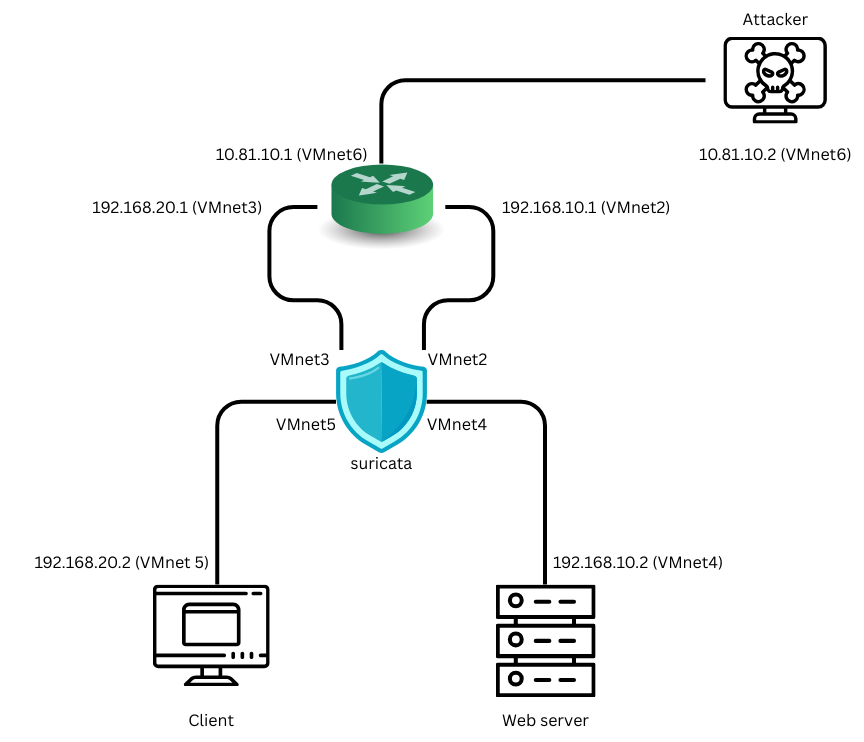

# Suricata – Intrusion Detection and Prevention System (IDS/IPS)

## Topology

## Implementation Scenarios

### Scenario 1: Stress Testing Suricata Performance
- **Description**: Generate high-volume and diverse network traffic to test Suricata’s multithreaded performance. Requires at least 2 vCPUs.
- **Tools**: `htop`, `iperf3`, `hping3`
- **Report**:
---

### Scenario 2: NMAP Port Scanning
- **Description**: An attacker uses nmap to perform port scanning on a user machine. Suricata detects abnormal behavior (e.g., more than 5 SYN/SYN+ACK packets within 30 seconds) and blocks the source IP.
- **Tools**: `nmap`
- **Report**:
---

### Scenario 3: SQL Injection on Web Server
- **Description**: Simulate an SQL Injection attack on a DVWA web application hosted on Apache. Suricata detects the intrusion using built-in signatures and logs the incident.
- **Tools**:
  - Web hosting: `Apache`, `DVWA`
  - Attack: `Burp Suite`
- **Report**:
---

### Scenario 4: Malware Detection and File Extraction
- **Description**: A client downloads malware via HTTP. Suricata scans file checksums within packets, detects malicious content, and extracts the file to a quarantine folder for later analysis. The infected packet is then dropped.
- **Report**:
---

### Scenario 5: Phishing Email and Shellcode Execution
- **Description**: An attacker sends a phishing email containing embedded shellcode, aiming for remote code execution. Suricata detects the shellcode pattern and interrupts the connection.
- **Tools**:
  - Email delivery: `Gmail`, `GoPhish`
- **Report**:
