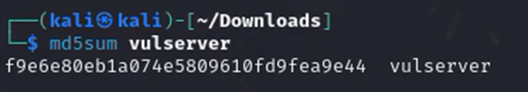
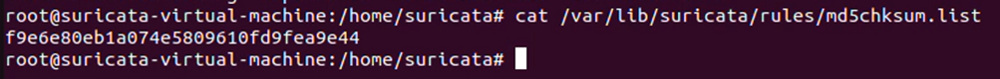
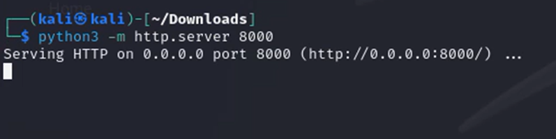
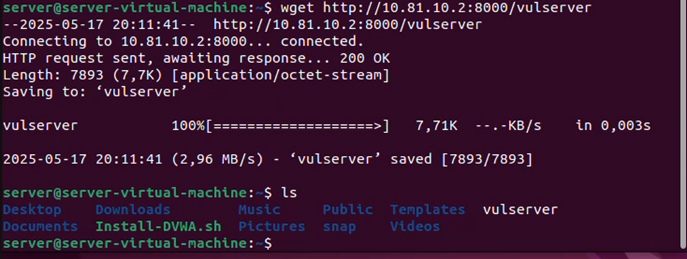
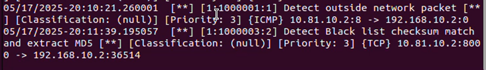
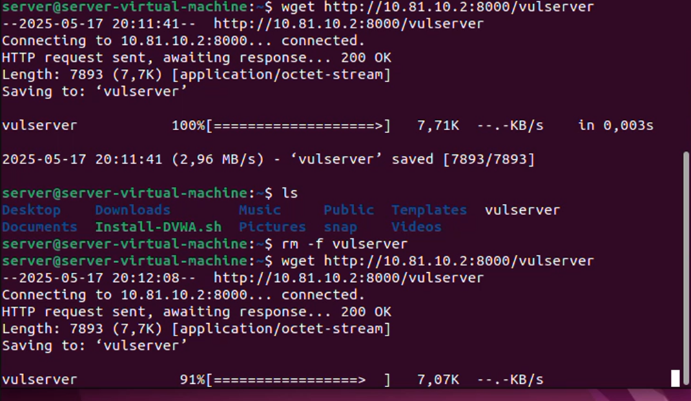
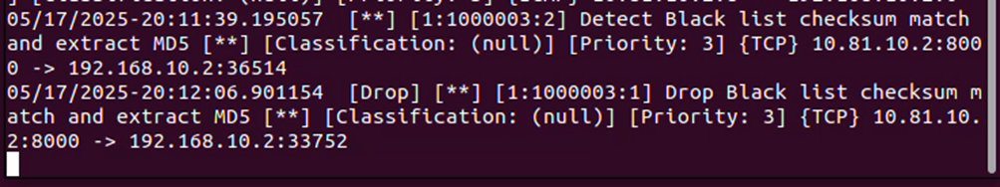
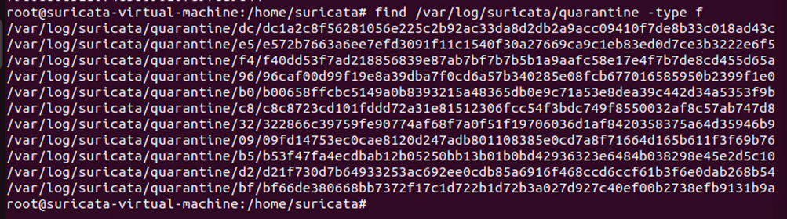

# Malware Detection and File Extraction
---

## Description

- A malicious file is hosted on a Kali Linux machine using a Python HTTP server.
- A server attempts to download the malicious file.
- Suricata detects the malware using its MD5 checksum from a pre-defined blacklist.
- Suricata drops the packet and stores the extracted malicious file in a quarantine folder for further analysis.

---

## Deployment Steps

### 1. Set Up the Quarantine Folder on Suricata

```bash
sudo mkdir -p /var/log/suricata/quarantine/
sudo chown -R suricata:suricata /var/log/suricata/quarantine
```

### 2. Suricata Rules
**Alert Rule**
```suricata
alert http $EXTERNAL_NET any -> $HOME_NET any (msg:"Detect Black list checksum match and extract MD5"; filemd5:md5chksum.list; sid:1000003; rev:1;)
```
**Drop and Store Rule**
```suricata
drop http $EXTERNAL_NET any -> $HOME_NET any (msg:"Drop Black list checksum match and extract MD5"; filemd5:md5chksum.list; file store; sid:1000003; rev:2;)
```

---

## Demonstration
### 1. Create the MD5 Checksum List
Create a file named md5chksum.list in the /var/lib/suricata/rules directory. Then add the MD5 checksum of the malicious file to this list.
<p align="center"></p>
<p align="center"></p>

### 2. Host the HTTP Server
On the Kali machine, run a Python HTTP server to host the malware file:

```bash
python3 -m http.server 8000
```
<p align="center"></p>

### 3. Download Attempt with Alert Rule
The server attempts to download the file.
<p align="center"></p>
Suricata logs a detection alert but allows the download.
<p align="center"></p>

### 4. Download Attempt with Drop Rule
The server attempts to download the file again.
<p align="center"></p>
Suricata drops the connection and stores the file.
<p align="center"></p>

### 5. Quarantine Storage
Suricata stores the dropped and matched malicious files in the quarantine folder:
`/var/log/suricata/quarantine/`
<p align="center"></p>
