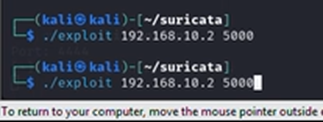

# Phishing Email and Shellcode Execution
---
## Description
This scenario simulates a multi-phase attack and demonstrates how Suricata can detect and block each stage:
### Phase 1 – Phishing

- A fake mail server is hosted using Python to receive emails.
- The attacker (Kali machine) sends a phishing email using `swaks`, attaching a malicious ELF file.
- The server receives and executes the ELF file.
- Suricata detects the ELF binary in the SMTP packet based on its file signature (`7F 45 4C 46`) and drops the packet.

### Phase 2 – Shellcode

- The attacker sends shellcode to exploit the system, attempting to establish a reverse shell.
- Suricata detects a typical NOP sled pattern often used in buffer overflow attacks and blocks the shellcode.

### Phase 3 – Reverse Shell

- The server, now compromised, attempts to initiate a reverse shell back to the Kali machine on port 4444.
- Suricata detects suspicious command usage (`whoami`, `pwd`) within the reverse shell and interrupts the connection.
---
## Deployment Steps

### 1. Simulate a Mail Server
A simple Python script is used to emulate an SMTP server to receive emails.

### 2. Send the Phishing Email from Kali

Use `swaks` to send an email with an ELF attachment:

```bash
swaks --to server@gmail.com \
    --from attacker@gmail.com \
    --server 192.168.10.2 \
    --port 25 \
    --header "Subject: Your App" \
    --body "Please execute this app to accept the reward kekeke." \
    --attach @/home/kali/suricata/vulserver
```

### 3. Suricata Rules
**Phase 1: Detect ELF File in SMTP Attachment**
```suricata
drop smtp $EXTERNAL_NET any -> $HOME_NET 25 (msg:"Phase 1: CUSTOM POLICY ELF File Detected in SMTP Attachment"; flow:to_server,established; file_data; content:"|7F 45 4C 46|"; filestore; classtype:policy-violation; sid:2000001; rev:2;)
```
**Phase 2: Detect NOP Sled in Shellcode**
```suricata
drop tcp $EXTERNAL_NET any -> $HOME_NET any (msg:"Phase 2: CUSTOM EXPLOIT NOP Sled Detected and Blocked"; flow:to_server,established; content:"|90 90 90 90 90 90 90 90|"; classtype:shellcode-detect; sid:2000002; rev:2;)
```
**Phase 3: Detect Reverse Shell Commands**
```suricata
drop tcp $EXTERNAL_NET any -> $HOME_NET any (msg:"Phase 3: CUSTOM REVERSE_SHELL Possible Shell Prompt (e.g., whoami)"; flow:to_client,established; content:"whoami"; depth:10; classtype:trojan-activity; sid:2000003; rev:2;)

drop tcp $EXTERNAL_NET any -> $HOME_NET any (msg:"Phase 3: CUSTOM REVERSE_SHELL Possible Shell Prompt (e.g., pwd)"; flow:to_client,established; content:"pwd"; depth:10; classtype:trojan-activity; sid:2000004; rev:2;)
```
---
## Demonstration
### Phase 1: Phishing Email
Server opens SMTP port to receive emails.
<p align="center"></p>
Kali confirms port 25 is open.
<p align="center"></p>
Email is successfully sent with ELF attachment.
<p align="center"></p>
Server receives and executes the file.
<p align="center"></p>
<p align="center"></p>

**Result with Suricata rule:**
Suricata blocks the SMTP packet with ELF attachment.
<p align="center"></p>
Suricata logs show detection and drop action.
<p align="center"></p>

### Phase 2: Shellcode Delivery
Attacker sends exploit with shellcode payload.
<p align="center"></p>

**Result with Suricata rule:**
Packet is dropped. Reverse shell is not established.
<p align="center"></p>
<p align="center"></p>
Suricata logs show NOP sled detection.
<p align="center"></p>

### Phase 3: Reverse Shell Command Execution
Server successfully establishes a reverse shell to Kali.
<p align="center"></p>
Attacker issues command like whoami.

**Result with Suricata rule:**
Connection is terminated after the command.
<p align="center"></p>
Suricata logs show detection of reverse shell activity.
<p align="center"></p>