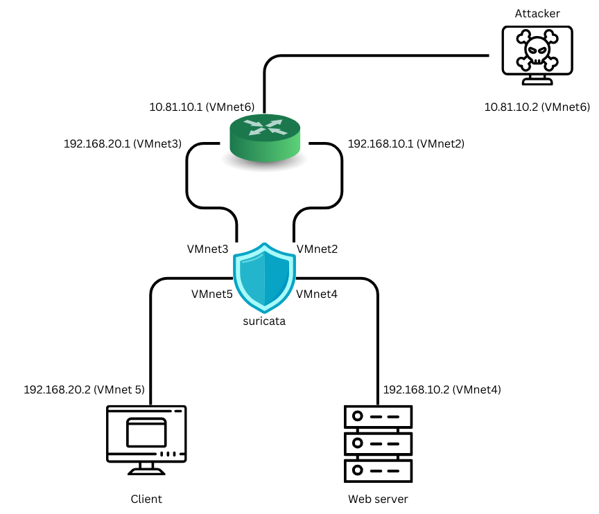

# 🛠️ Setup Suricata on VMware

## 🌐 Network Topology

### 🔸 Router
- `ens33`: `192.168.42.130` (NAT)
- `ens34`: `192.168.10.1` → `vm2`
- `ens35`: `192.168.20.1` → `vm3`
- `ens39`: `10.81.10.1` → `vm6`

### 🔸 Server
- `ens33`: `192.168.10.2` → `vm4`

### 🔸 Client
- `ens33`: `192.168.20.2` → `vm5`

### 🔸 Kali
- `ens33`: `10.81.10.2` → `vm6`

### 🔸 Suricata IDS/IPS
- `ens33`: `192.168.42.142` (NAT)
- `ens34`: connected to `vm3`
- `ens35`: connected to `vm5`
- `ens39`: connected to `vm4`
- `ens40`: connected to `vm2`

## ⚙️ Router Configuration

### Enable IP Forwarding
```bash
sudo nano /etc/sysctl.conf
```
Uncomment the following line:
```bash
net.ipv4.ip_forward=1
```
Apply change
```bash
sudo sysctl -p
```

### Setup NAT (`ens33` as NAT interface)
```bash
sudo iptables -t nat -A POSTROUTING -o ens33 -j MASQUERADE
```

### Check Routing Table
```bash
ip route
```

Sample output:
```
default via 192.168.42.2 dev ens33 proto dhcp src 192.168.42.132 metric 100 
192.168.10.0/24 dev ens34 proto kernel scope link src 192.168.10.1 
192.168.20.0/24 dev ens35 proto kernel scope link src 192.168.20.1 
192.168.42.0/24 dev ens33 proto kernel scope link src 192.168.42.132 metric 100 
192.168.42.2 dev ens33 proto dhcp scope link src 192.168.42.132 metric 10
```

## Suricata Configuration

### Enable IP Forwarding
```bash
sudo nano /etc/sysctl.conf
```
Uncomment the following line:
```bash
net.ipv4.ip_forward=1
```
Apply change
```bash
sudo sysctl -p
```

### Edit Suricata Configuration
File: `/etc/suricata/suricata.yaml`

```yaml
af-packet:
  - interface: ens34
    # threads: 1 (or auto)
    cluster-id: 98
    cluster-type: cluster_flow  # Important for IPS
    defrag: no
    copy-mode: ips              # Important for IPS
    copy-iface: ens35           # Partner interface

    - interface: ens35
    cluster-id: 97
    cluster-type: cluster_flow
    defrag: no
    copy-mode: ips
    copy-iface: ens34

    - interface: ens39
    cluster-id: 96
    cluster-type: cluster_flow
    defrag: no
    copy-mode: ips
    copy-iface: ens40 

    - interface: ens40
    cluster-id: 95
    cluster-type: cluster_flow
    defrag: no
    copy-mode: ips
    copy-iface: ens39

...

livedev:
  use-for-tracking: false
```

### Start Suricata
```bash
sudo suricata -c /etc/suricata/suricata.yaml --af-packet
```

### View Logs
```bash
tail -f /var/log/suricata/fast.log
```

### Reload Rules
```bash
sudo kill -usr2 $(pidof suricata)
```

### DNS configure
Edit file: `/etc/systemd/resolved.conf`
```bash
[Resolve]
DNS=8.8.8.8 1.1.1.1
FallbackDNS=8.8.4.4 1.0.0.1
```
Apply change:
```bash
sudo systemctl restart systemd-resolved.service
```

**Note:** Configure NAT Routing on Router is temporary, need to run command again when rebooting
